# Loja API REST

Um sistema de compra de produtos em uma loja, desenvolvido no curso de JAVA do Nelio Alves, onde ele  
retorna um JSON com informações do produto, sua categoria, ordem de pedido e o cliente.

## 📋 Pré-requisitos

```
Java 17 ou 21
Postman
IDE Intellij ou Eclipe
```

## ⚙️ Executando os testes

Inicie o programa na IDE de sua escolha e utilize o Postman para realizar os seguintes testes.

### 👨‍💼 Teste no usuario

No usuário, podemos:  
- Consultar todos os usuários  
- Consultar apenas um usuário pelo seu ID  
- Inserir um novo usuário  
- Deletar um usuário a partir do seu ID  
- Alterar um usuário a partir do seu ID  
***
No Postman, utilize os seguintes comandos para visualizar os dados:

```
GET http://localhost:8080/users - todos os usuários  
GET http://localhost:8080/users/1 - usuário pelo ID 
```
#### Exemplo: 

**Todos os usuários:** 

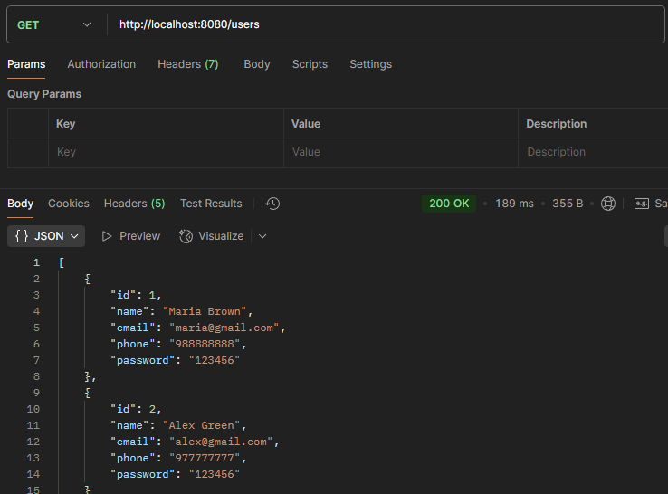

**Usuário pelo ID:**  

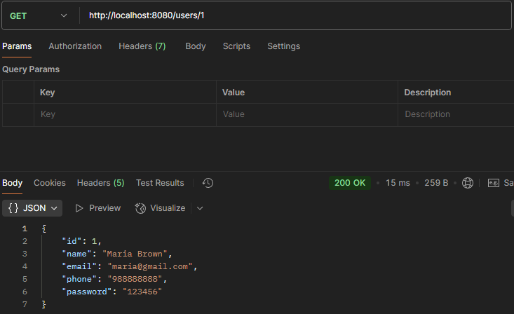

No Postman, use o seguinte comando para inserir dados:

```
POST http://localhost:8080/users
```

📝 **Configurar o Postman para inserir dados**

**Body:**
```json
{
  "name": "Bob Brown",
  "email": "bob@gmail.com",
  "phone": "977557755",
  "password": "123456"
}
```

**Headers:**

| Key           | Value               |
|--------------|---------------------|
| Content-Type | application/json    |

#### Exemplo:

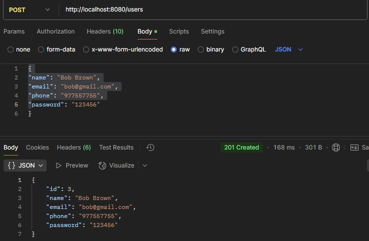

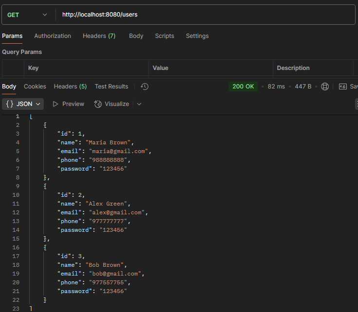

No Postman, use o seguinte comando para alterar os dados:

```
PUT http://localhost:8080/users/1
```

**Body:**
```json
{
  "name": "Mario Bros",
  "email": "mariobros@gmail.com",
  "phone": "567895645"
}
```

#### Exemplo:

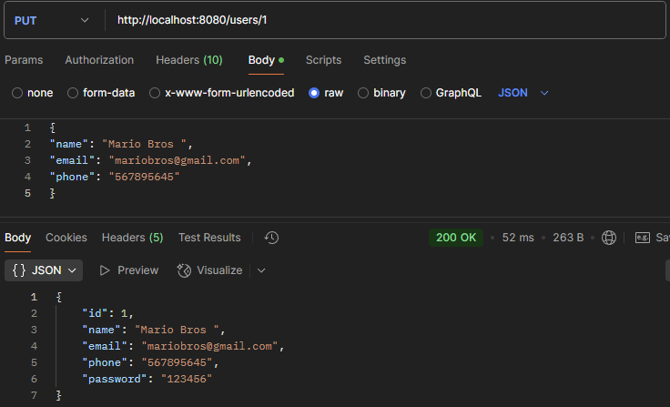

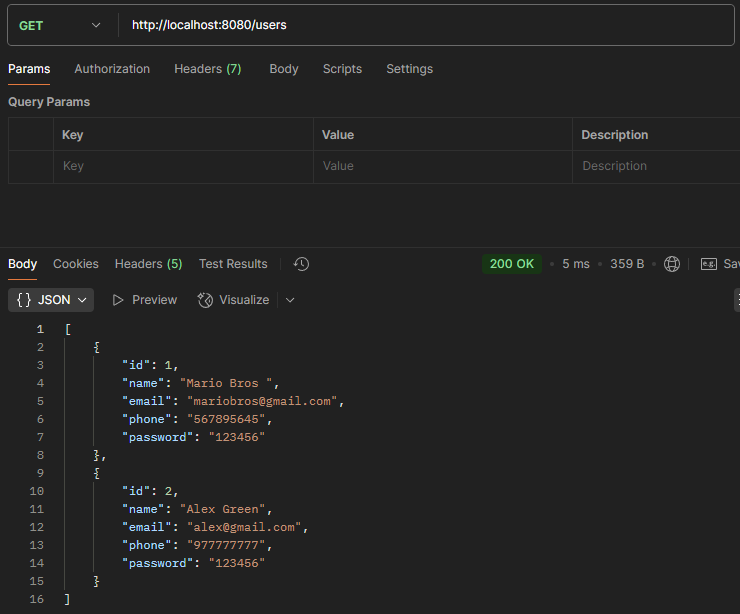

No Postman, use o seguinte comando para deletar um usuário:

```
DELETE http://localhost:8080/users/3
```
#### Exemplo:


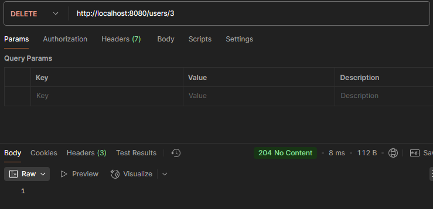


### 📦 Teste no Produto

No produto, podemos:  
- Consultar todos os produtos  
- Consultar apenas um produto pelo seu ID 
***

```
GET http://localhost:8080/products - todos os produtos
GET http://localhost:8080/products/1 - produto pelo ID
```

#### Exemplo:

**Todos os produtos:** 

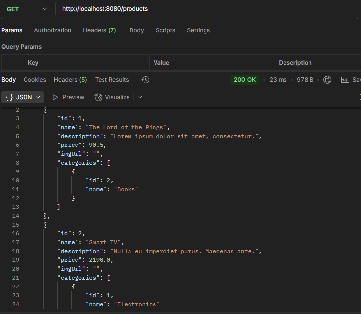

**Produto pelo ID:** 

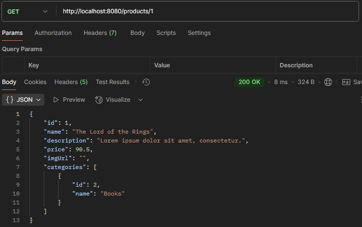

### 🛒 Teste no Ordem

Na ordem, podemos:  
- Consultar todas as compras finalizadas  
- Consultar o total das compras e o cliente associado  
- Consultar apenas uma ordem de compra pelo seu ID  
***

```
GET http://localhost:8080/orders - todas as ordens de compra
GET http://localhost:8080/orders/1 - ordem de compra pelo ID 
```

#### Exemplo:


### 🔖 Teste na Categoria

Na categoria, podemos:  
- Consultar todas as categorias  
- Consultar apenas uma categoria pelo seu ID  
***

```
GET http://localhost:8080/categoryes - todas as categorias
GET http://localhost:8080/categoryes/1 - categoria pelo id
```
#### Exemplo:

**Todas as categorias:**  

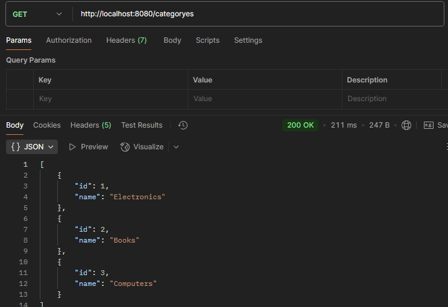

**Categoria pelo ID:** 

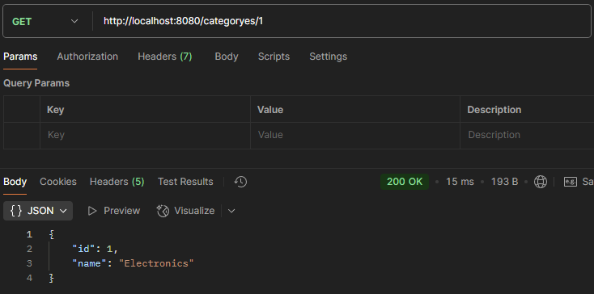


## 🛠️ Construído com

* **Java** - Linguagem de programação  
* **Spring Boot** - Framework  
* **H2** - Banco de dados de teste 


